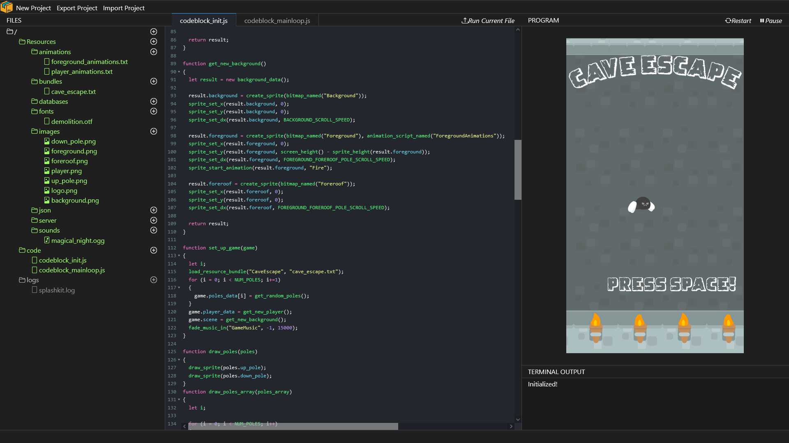

[](https://github.com/thoth-tech/SplashkitOnline/graphs/contributors)
[](https://github.com/thoth-tech/SplashkitOnline/issues)
[](https://github.com/thoth-tech/SplashkitOnline/pulls)
[](https://thoth-tech.github.io/SplashkitOnline/)
[](https://github.com/thoth-tech/SplashkitOnline/network/members)
[](https://github.com/thoth-tech/SplashkitOnline/stargazers)

# SplashKit Online

SplashKit Online is a browser-based development environment for beginner programmers!
With it you can immediately get started programming in JavaScript and/or C++ using the [SplashKit](https://splashkit.io) library, which is an easy to use library for handling input, graphics, and sound - everything you need to make a game!

[](https://thoth-tech.github.io/SplashkitOnline/)

<p align="center">
  <a href="https://thoth-tech.github.io/SplashkitOnline/">
    
  </a>
</p>

## Table Of Contents
- [Table Of Contents](#table-of-contents)
- [Installation](#installation)
  - [Setting up the IDE](#setting-up-the-ide)
- [Project Goals and Structure](#project-goals-and-structure)
- [Technology/Design Overview](#technologydesign-overview)
  - [IDE](#ide)
  - [Code Execution](#code-execution)
    - [JavaScript "Backend"](#javascript-backend)
    - [C++ "Backend"](#c-backend)
- ["Backend" Development](#backend-development)
  - [SplashKit Wasm Library Manual Compilation (JavaScript backend)](#splashkit-compiler-library-manual-compilation-c-backend)
  - [SplashKit Compiler Library Manual Compilation (C++ backend)](#splashkit-compiler-library-manual-compilation-c-backend)
- [License](#license)


## Installation

Standard installation (of JavaScript and C++ support) involves two steps:

 1. Setting up the IDE
 2. Downloading the SplashKit WASM binaries

### Setting up the IDE
The IDE is just a simple node project with few dependencies, and can be setup with the following lines:
```bash
git clone --recursive https://github.com/thoth-tech/SplashkitOnline.git
cd SplashkitOnline/Browser_IDE/
npm install
```
However, we also need to import the compiled SplashKit library and compiler, as they are not included in the repository by default due to their size. The Node server will import the necessary files automatically on start-up, but this can also be achieved with the included `setup.py` script.
```bash
python3 setup.py # optional
npm run server
```
Now you'll be able to load up `localhost:8000` in a browser and see the IDE!

**Note:** For those concerned about downloading the binaries; these are _WebAssembly_ binaries, not native binaries like `.exe` - they execute securely inside the browser and have no access to the real computer/filesystem.

## Project Goals and Structure
The goal of the SplashKit Online IDE is to provide a beginner friendly programming environment targeted towards using the SplashKit library. It has REPL like functionality to allow rapid feedback, with emphasis on game related functionality like interactivity, graphics rendering and audio playback. To support this, code execution happens in the browser (hence compiling SplashKit to run in the browser), as does compilation does as well. We currently have support for compiling/running JavaScript _and_ C++ in the browser, with support for C# under development. 

For clarity, while we refer to various language "backends" in later parts of this readme, this is not referring to a server backend as in web development. SplashKit Online is designed so that everything can be served statically.

## Technology/Design Overview
### IDE
The IDE is written as simply as possible, using straight HTML, CSS and JavaScript. The code editors use the CodeMirror library (version 5) to provide syntax highlighting and other editing features. It is currently ran by using node for some reason, however as demonstrated by the unofficial demo, any sort of static page server can do the trick (such as `python -m http.server`)

### Code Execution
#### JavaScript "Backend"
When the user's JavaScript is ran, it is executed securely inside an iFrame after some code transformations to make it run asynchronously and within a custom scope.

The SplashKit API has been exposed to the global scope of JavaScript, allowing the user to interface with it in much the same way they can in other languages, like C++ and Python. Calls to the SplashKit API are then executed by the SplashKit Wasm module as native code (or as native as it gets in a browser).

##### SplashKit Library
The SplashKit library handles all input, graphics, audio and file handling, and is invoked by the user's JavaScript. The library has been compiled into a WebAssembly (Wasm) module via Emscripten. This module is loaded into the page as soon as the IDE starts, and the functions in it exported as JavaScript functions.

#### C++ "Backend"
The user's code is compiled using a custom version of [_Clang_](https://clang.llvm.org/) compiled to WebAssembly - the code is compiled in-browser! 

The final binary is of course WebAssembly as well, and is linked to a WebAssembly SplashKit library object file. This library file is a bit different to the one used in the JavaScript backend.

Finally this binary is executed securely in an asynchronous WebWorker. The WebWorker passes commands back to the main window, which then handles actually rendering graphics, playing audio, passing user input back, etc.

## "Backend" Development

### SplashKit Wasm Library Manual Compilation (JavaScript backend)
First you'll need to install Emscripten, which will be used to compile SplashKit to Wasm so it can be used in the browser. The easiest way to do this is via the `emsdk`. Installation instructions are here - [Getting Started](https://emscripten.org/docs/getting_started/downloads.html)

Once you've got Emscripten installed and activated, you can compile the SplashKit Wasm library! We've included SplashKit's source code as a submodule, along with the scripts to compile it as a Wasm library, directly in this repo.

Currently only cmake builds are supported, so navigate to the cmake project and build it using Emscripten's `emcmake` and `emmake` wrappers.
```bash
cd SplashkitOnline\SplashKitWasm\cmake
emcmake cmake -G "Unix Makefiles" .
emmake make
```
If all goes well, you should find the three files built and copied to inside `Browser_IDE/runtimes/javascript/bin/` and `Browser_IDE/splashkit/` - if so, you're done!

### SplashKit Compiler Library Manual Compilation (C++ backend)
It is also possible to use C++ within SplashKit Online! This is still experimental, and as such is missing some features and can be a bit unstable. However, the majority of graphics, audio, and input functionality works, and you can use it to compile and test regular C++ programs too!

There are three main pieces to the compiler:
1. Clang
2. System root files (includes, standard library, etc)
3. SplashKit Library Object

If you want to compile some of this yourself, currently the repository supports building both the C++/JavaScript runtimes, and the Compiler System Root Files (partially). We don't support compiling Clang currently, though we'd like to find a way to include this in the repository as well.

To compile these:
1. Place [sysroot.zip](https://github.com/WhyPenguins/SplashkitOnline/tree/cxx_language_backend_binaries/SplashKitWasm/prebuilt/sysroot.zip) at `SplashKitWasm/prebuilt/` (don't unzip it!)
2. Run:
```bash
cd SplashkitOnline\SplashKitWasm\cmake
emcmake cmake -G "Unix Makefiles" -DENABLE_CPP_BACKEND=ON .
emmake make -j8
```

For more info, see the [this pull request](https://github.com/thoth-tech/SplashkitOnline/pull/65).

## License

Most of the SplashKit Online IDE is licensed under the GNU General Public License v3.0

Some of it is unlicensed - this code will be either removed shortly (it is no longer used) or the original authors contacted and properly licensed.
